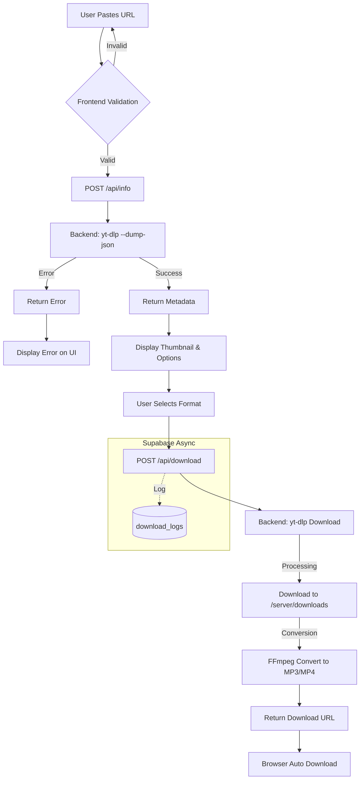

# System Flowchart

## Explanation
1. **Input**: User provides a URL from supported platforms.
2. **Analysis**: Server queries `yt-dlp` for metadata without downloading.
3. **Selection**: User chooses resolution or format.
4. **Processing**: Server downloads and processes the file using `yt-dlp` (which uses FFmpeg).
5. **Delivery**: File is served via a temporary static link.
